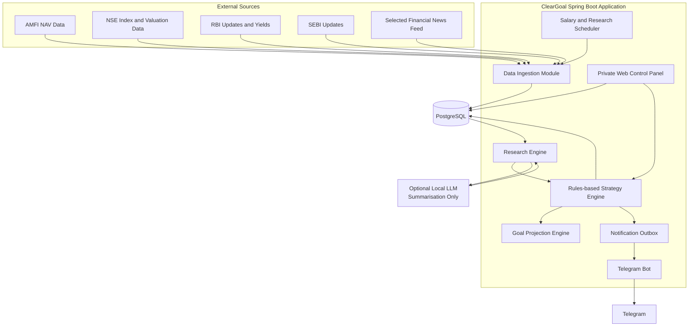
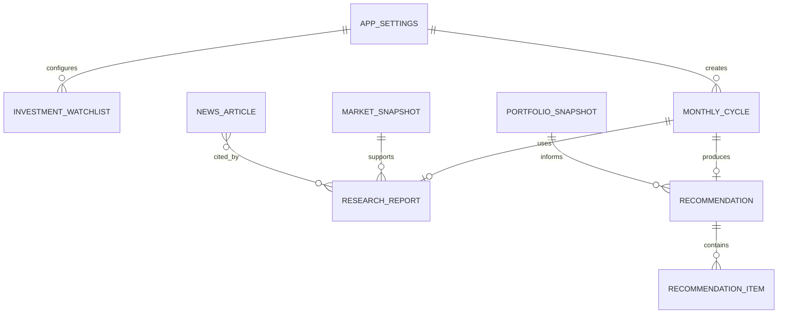
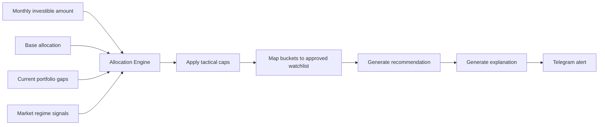

# Architecture

## Architecture style

ClearGoal uses a **Spring Boot modular monolith**.

This is intentional. The application is personal, has low traffic, and runs a small number of scheduled workflows. Microservices would increase deployment, observability, networking, and data-consistency work without creating value.

## High-level architecture



## Runtime components

### 1. Spring Boot application

A single deployable service containing all modules.

Responsibilities:

- Scheduled jobs
- Data ingestion
- News deduplication
- Research generation
- Strategy calculation
- Goal projection
- Telegram commands and callbacks
- Minimal REST endpoints
- Private web control panel
- Operational health checks

Recommended stack:

- Java 21
- Spring Boot 3
- Spring Web
- Spring Data JPA
- Spring Scheduler
- Spring Retry
- Spring Validation
- Spring Actuator
- Flyway
- PostgreSQL driver
- Telegram Bot client
- OpenAPI for internal API documentation

### 2. PostgreSQL

PostgreSQL is the system of record.

It stores:

- Personal settings
- Approved investment watchlist
- Portfolio snapshots
- Market snapshots
- Source articles
- Research reports
- Monthly cycles
- Recommendations
- Recommendation items
- Notification outbox events

### 3. Telegram

Telegram is the primary user interface.

It provides:

- Salary-day alert
- Preview alert
- Follow-up reminders
- Research summary
- Investment confirmation
- Progress response
- Failure notification

### 4. Private web control panel

The web UI is intentionally small.

Use it for:

- Editing salary date and investment amount
- Updating base allocation
- Managing the approved watchlist
- Updating the latest corpus value
- Reviewing source data and full research
- Re-running failed jobs
- Viewing recommendation history

### 5. Optional LLM

A local model through Ollama may be added after the deterministic system works.

Allowed responsibilities:

- Summarise headlines
- Cluster repeated news themes
- Produce a concise explanation from computed signals

Forbidden responsibilities:

- Selecting funds
- Calculating allocation percentages
- Changing the monthly amount
- Making unsourced factual claims
- Issuing independent buy or sell instructions

## Application modules

```text
com.cleargoal
├── settings
├── watchlist
├── portfolio
├── marketdata
├── news
├── research
├── strategy
├── goal
├── monthlycycle
├── telegram
├── notification
├── web
└── shared
```

Recommended internal package structure:

```text
module/
├── api
├── application
├── domain
└── infrastructure
```

## Module responsibilities

### `settings`

- Goal amount
- Salary day
- Default investment amount
- Time zone
- Base allocation
- Tactical limits
- Telegram configuration

### `watchlist`

- Approved instruments
- Bucket classification
- Allocation caps
- Active status

### `portfolio`

- Monthly portfolio snapshot
- Current allocation
- Allocation gaps
- Total corpus
- Total invested capital

### `marketdata`

- NAV ingestion
- Index valuation ingestion
- Yield ingestion
- Source timestamps
- Data-quality status

### `news`

- RSS or API ingestion
- Deduplication
- Source classification
- Topic tagging

### `research`

- Builds the monthly research report
- Calculates market regime
- Stores observations and sources
- Assigns confidence level

### `strategy`

- Starts from base allocation
- Calculates portfolio gaps
- Applies bounded tactical changes
- Selects only approved watchlist instruments
- Produces recommendation items and rationale

### `goal`

- Calculates ₹1 crore progress
- Estimates target date
- Calculates the impact of the current month’s investment

### `monthlycycle`

- Creates and tracks one cycle per month
- Stores expected, available, and actual amounts
- Manages lifecycle status

### `telegram`

- Commands
- Inline buttons
- Message templates
- Callback handling

### `notification`

- Transactional outbox
- Retry handling
- Delivery status
- Failure alerts

## Data model



Core tables:

```text
app_settings
investment_watchlist
portfolio_snapshot
market_snapshot
news_article
research_report
monthly_cycle
recommendation
recommendation_item
notification_outbox
```

## Monthly-cycle statuses

```text
UPCOMING
RESEARCH_RUNNING
RESEARCH_READY
RECOMMENDATION_READY
PREVIEW_SENT
ALERT_SENT
PARTIALLY_INVESTED
COMPLETED
SKIPPED
FAILED
```

## Recommendation calculation



The calculation must be deterministic and replayable. The same saved inputs and strategy version must produce the same result.

## Scheduler design

Default schedule:

| Time | Job |
|---|---|
| 28th, 18:00 | Fetch data and news |
| 28th, 18:20 | Generate research |
| 29th, 21:00 | Generate and send preview |
| Salary day, 09:00 | Send final recommendation |
| Following month, 1st, 20:00 | First reminder if incomplete |
| Following month, 3rd, 20:00 | Final reminder |

All times should use the configured time zone.

## Reliability patterns

### Transactional outbox

Recommendation creation and notification scheduling should occur in the same database transaction. A separate worker sends Telegram messages and updates delivery status.

### Idempotency

Each monthly cycle must have a unique key such as `2026-08`. Jobs must be safe to retry without generating duplicate recommendations or messages.

### Source freshness

A recommendation must not be sent if critical data is stale beyond configured thresholds. Instead, ClearGoal sends a failure alert requiring manual review.

### Auditability

Store:

- Strategy version
- Input snapshot IDs
- Signal scores
- Tactical adjustments
- Final allocation
- Source references
- Generation time

## Deployment

Initial deployment:

```text
Docker Compose
├── cleargoal-app
└── postgres
```

Optional later addition:

```text
└── ollama
```

Recommended host options:

- Personal laptop for development
- Home server or always-on mini PC
- Small private cloud VM

## Security

Because the application is private:

- Do not expose PostgreSQL publicly.
- Keep bot tokens and credentials in environment variables or secrets.
- Restrict Telegram commands to the configured chat ID.
- Protect the web panel with a strong password and private network access.
- Encrypt backups.
- Avoid storing bank credentials, PAN, KYC documents, or broker passwords.
- Store source URLs and market data, not private financial account credentials.
