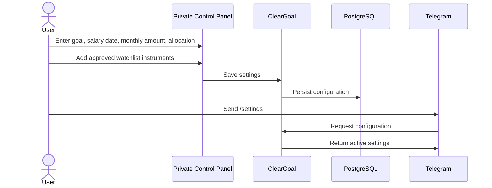
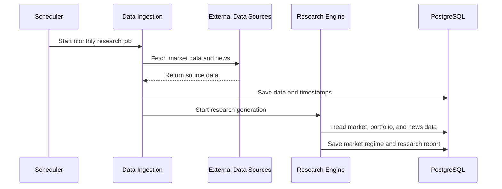
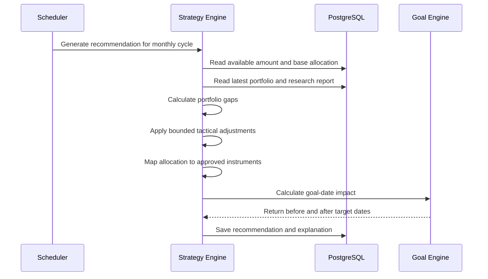
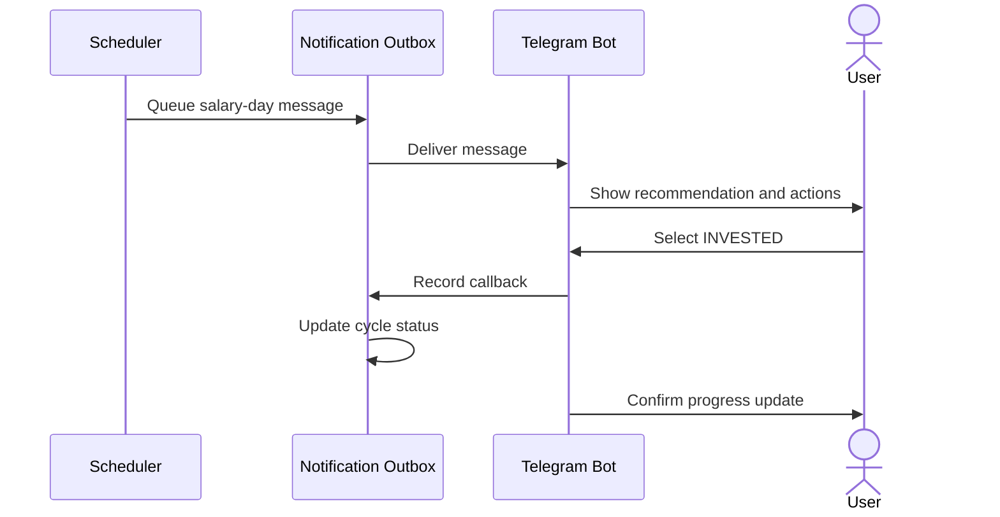
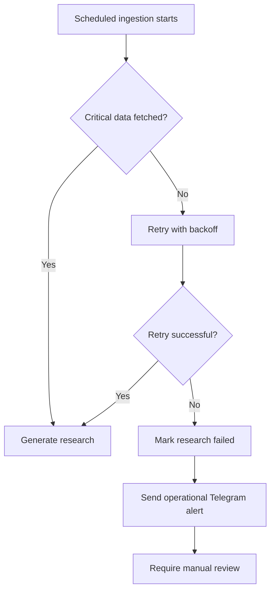

# Core Flows

## 1. First-time setup



## 2. Research generation



## 3. Recommendation generation



## 4. Salary-day alert



## 5. Manual corpus update

The MVP does not integrate with broker or bank accounts.

The user periodically copies the current corpus from an existing investment application:

```text
/updatevalue 1245000
```

ClearGoal stores a new portfolio snapshot and recalculates:

- Goal progress
- Remaining amount
- Estimated gains
- Current allocation gaps
- Expected target date

## 6. Failed data workflow



ClearGoal must not silently generate a recommendation from incomplete or stale data.
