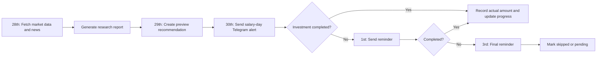

# ClearGoal Wiki

> **Personal salary-day investment research, recommendation, alert, and goal-tracking system.**

ClearGoal is a private application built for one user. It is not intended to replace existing investment platforms, execute transactions, or become a full portfolio-management product.

Its job is simple:

1. Research the market before salary day.
2. Decide how this month’s investible amount should be distributed.
3. Send a clear Telegram alert on salary day.
4. Record whether the investment was completed.
5. Track progress towards a ₹1 crore corpus.

## Product statement

**ClearGoal helps me invest consistently after salary credit by combining market data, financial news, portfolio allocation gaps, and a rules-based strategy into one monthly action plan.**

## Core promise

Every month ClearGoal should answer five questions:

- How much am I investing this month?
- What is the current market condition?
- Where should fresh money be allocated?
- Why is this allocation being suggested?
- How much closer does this take me to ₹1 crore?

## Primary interface

Telegram is the primary interface. A small private web control panel is used only for settings, watchlist management, data corrections, and research review.

## What ClearGoal is not

- Not a trading application
- Not a broker or payment platform
- Not a public investment-advice product
- Not a daily market-alert application
- Not a replacement for Groww, Zerodha, Kuvera, Coin, MF Central, or bank apps
- Not a tax-reporting platform
- Not an automated buy/sell system

## Key design principles

1. **Alert first:** salary-day action is the centre of the product.
2. **Fresh money only:** rebalance primarily using new monthly investments.
3. **Rules decide, AI explains:** the strategy engine calculates allocations; the LLM may only summarise research and explain the output.
4. **Bounded changes:** market research can adjust the base allocation only within predefined limits.
5. **Low maintenance:** one backend, one database, one deployment.
6. **Source-aware:** every market observation should retain its source and timestamp.
7. **No noise:** no daily alerts unless a data job fails.

## Monthly lifecycle

## Wiki pages

- [MVP Scope](MVP.md)
- [Architecture](Architecture.md)
- [Core Flows](Core-Flows.md)
- [Delivery Plan](Delivery-Plan.md)
